# System Overview

This document explains how real users interact with the Migrant Health Records platform. It focuses on roles, journeys, and outcomes. Diagrams are provided to visualize flows.

- Audience: Judges, program managers, health officials
- Scope: Frontend UX, user flows, admin oversight, safety controls, and interoperability

## Personas and Roles

- Migrant (patient)
- Doctor (provider)
- Hospital
- Lab
- Admins (Super Admin, State Admin, District Admin, Subdivision Admin, Block Admin)

## High‑Level System Context

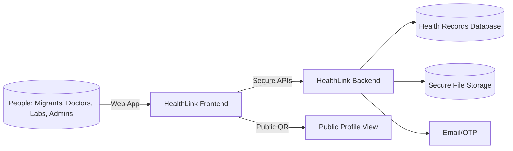

## Registration & Login (OTP supported)

- Email/password sign-up for all roles (migrant, doctor, hospital, lab)
- OTP support (email) for login and password reset

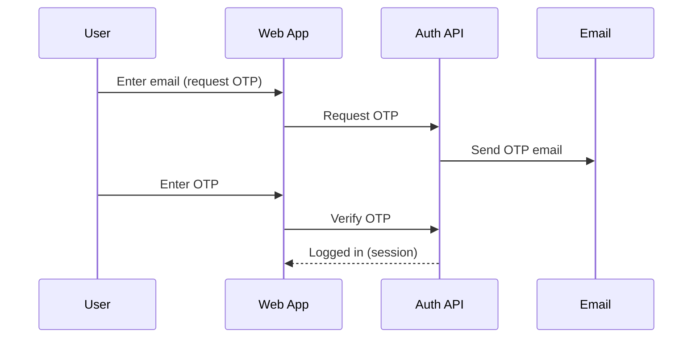

## Super Admin & Admin Hierarchy (Full Control vs Limited)

- Super Admin creates and manages the entire geo hierarchy.
- Admins are scoped to a geographic unit: State → District → Subdivision → Block/Municipality.
- Full Control delegates power to invite and manage the next level down; limited access allows viewing and basic operations within assigned scope.

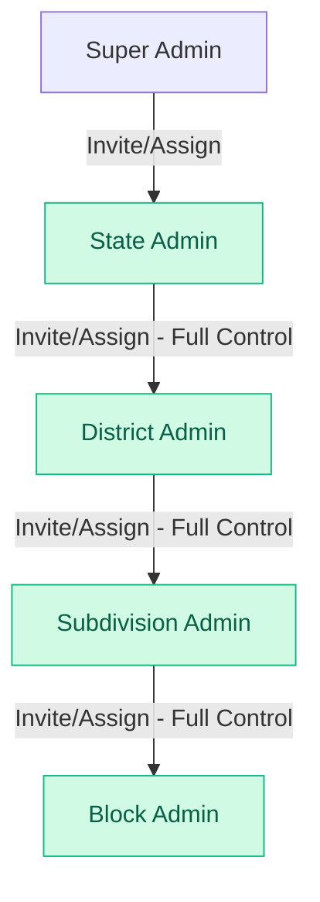

- Full Control enabled: admin can create invites and manage sub-units under their scope.
- Full Control disabled: admin can operate within their own scope (view data, manage within unit) but cannot delegate or create sub-admins.

## Creating New Jurisdiction Units

- Super Admin can create States; State Admins can create Districts; District Admins can create Subdivisions; Subdivision Admins can create Blocks.

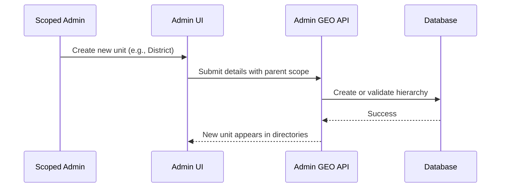

## Invitations and Admin Sign‑Up

- Super Admin or Full‑Control Admins can invite the next level admin.
- Invitee completes registration using a code; scope and permissions are enforced automatically.

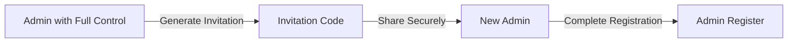

## Migrant Registration & QR/ID Card

- Migrants register, update profile, and can download a printable ID card (CR80)
- Each migrant has a Health ID and QR code linking to a public profile (limited, safe data)

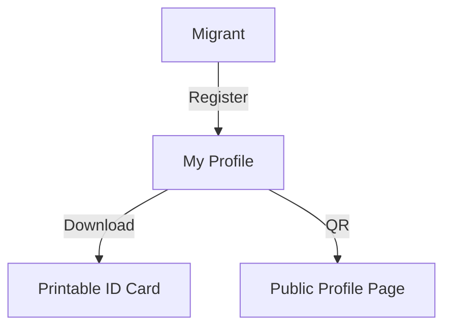

## Doctor–Patient Collaboration

- Doctors search/view patients (as permitted), create a Consultation Report (instead of technical term “encounter”), upload files, request lab reports, and manage vaccinations/allergies/medications.

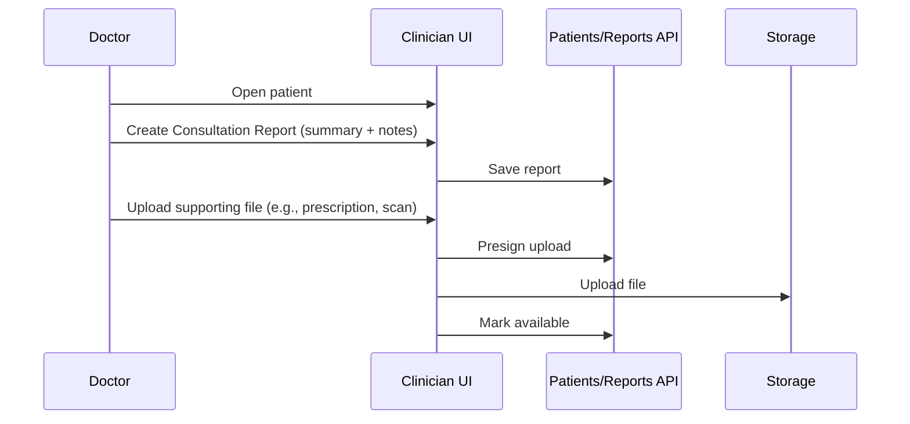

- Consultation Report = clinical visit summary (date, type, notes, optional diseases).
- Attachments = any supporting documents, safely stored and downloadable with permission.

## Consent (Patient‑Centric Access)

- Providers and hospitals need the migrant’s consent to view or update detailed records.
- Consent requests generate a one‑time code for the patient.
- Patient can revoke consent at any time.

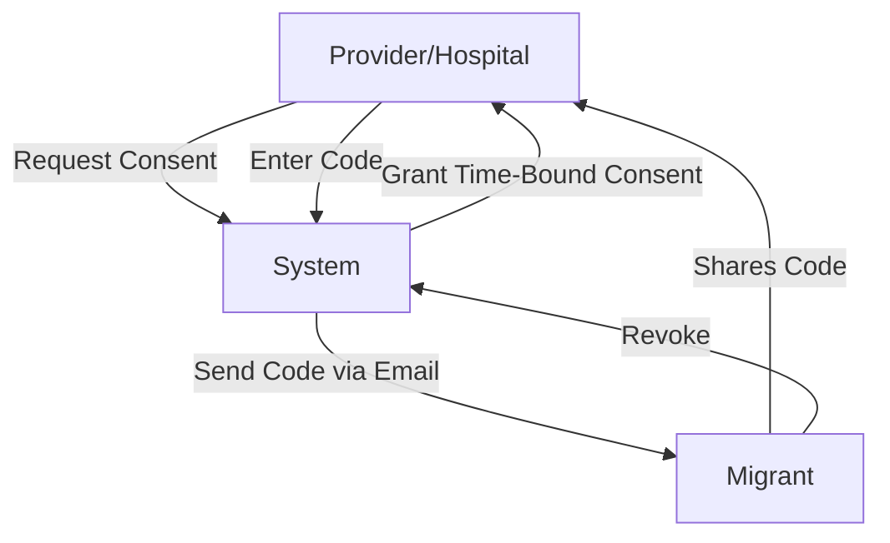

## Emergency Protocol

- In emergencies, a time‑limited read‑only access can be granted with audit logging.
- This enables safe access without a prior consent flow.

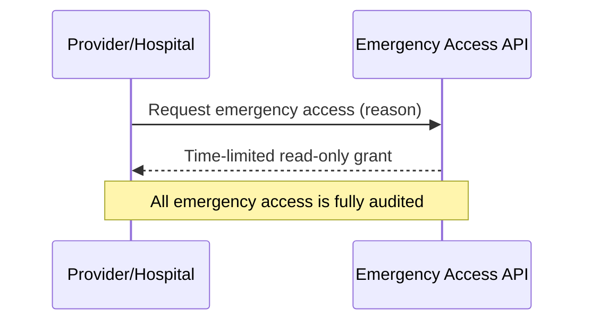

## Lab Workflow (Assigned Jobs, Uploads, CSV)

- Doctors can request lab reports; optionally assign a specific lab.
- Labs work from a dedicated Jobs panel: Assigned, Accepted, Denied.
- Labs can claim/accept jobs, deny with reason, upload finalized reports, and export tables to CSV.

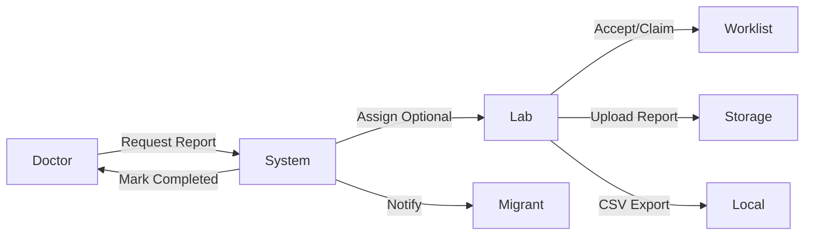

## Migrant Chatbot (Personal Health Assistant)

- Migrants can ask plain‑language questions.
- The assistant summarizes personal records and recent reports to give helpful, safe explanations.
- Multi‑language responses for Indian languages and English.
- Clear disclaimer: information only, not medical advice.

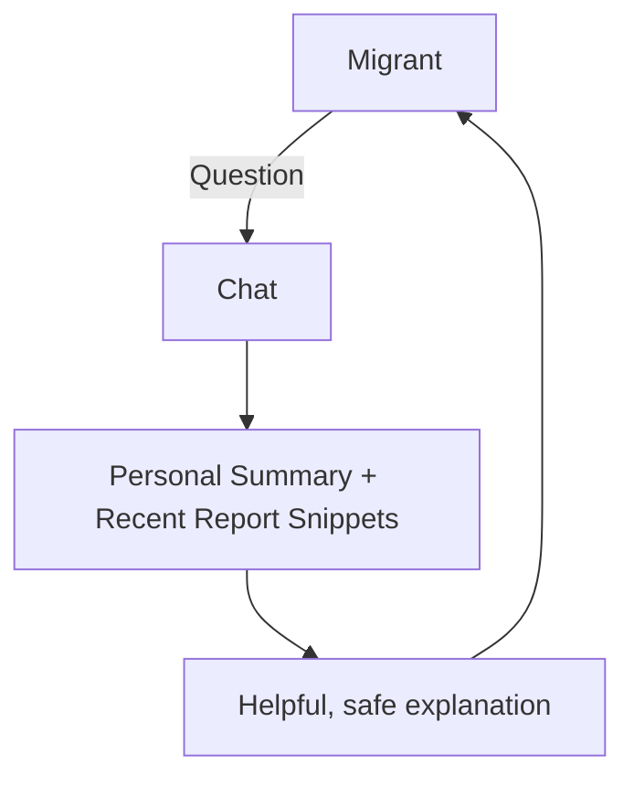

Key features:

- Answers in the user’s language when possible
- Can include insights from recent uploaded reports
- Designed to educate, not diagnose; always closes with a clear disclaimer

Community Health Initiative Malaria Control Leaderboard

•	A dedicated feature to aid in the control of malaria and other vector-borne diseases.

•	Migrants can actively participate by uploading pictures of potential mosquito breeding grounds (e.g., stagnant water) along with their geographic location.

•	The system maintains a leaderboard that showcases the names of migrants who have contributed the most verified reports.

•	This gamified approach encourages community participation in public health surveillance.

Government Schemes Dashboard

•	A dedicated dashboard for migrants that provides information on existing government schemes available to them in Kerala.

•	This feature aims to increase awareness and accessibility of welfare programs.

•	Schemes listed include, but are not limited to:

o	Awaz Health Insurance Scheme: Providing health insurance and death benefits.

o	Jyothi Scheme: Educational assistance for children of migrant workers.

o	Apna Ghar Project: Hostel facilities for migrant workers.

•	The dashboard provides details, eligibility criteria, and application guidance for each scheme.


## FHIR‑Compatible (Read‑Only Interoperability)

- The system exposes read‑only FHIR endpoints (e.g., Patient, Encounter, Observation, DocumentReference, Condition, Immunization, and $everything) to enable interoperability.
- This supports aggregation and safe external consumption by standards‑based client apps.

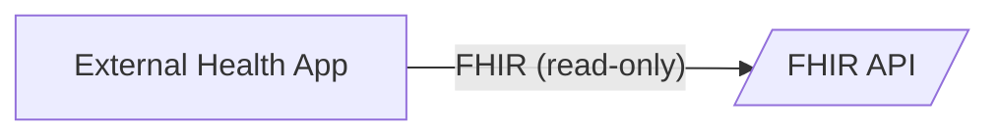

## Audit Logs (Transparency)

- Every important action (creating reports, uploading files, changing consent, emergency grants) is logged.
- Patient detail view shows who did what and when.
- Export/Record‑keeping: On‑page logs can be printed/downloaded for audits.

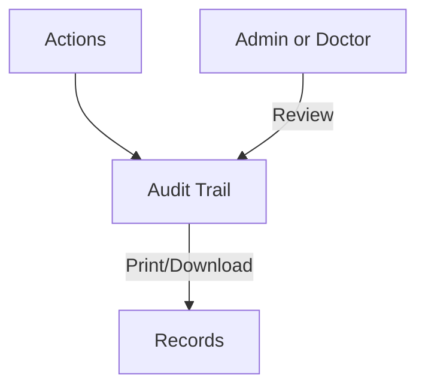

## Admin Dashboard & Heatmap

- KPIs: users, patients, consultation reports, attachments, active consents
- Time‑series charts: growth and trends
- Choropleth heatmap for geography‑aware insights
- Quick actions: invite admins, manage admins, jurisdiction requests
- Download option: One‑click PDF of the dashboard view

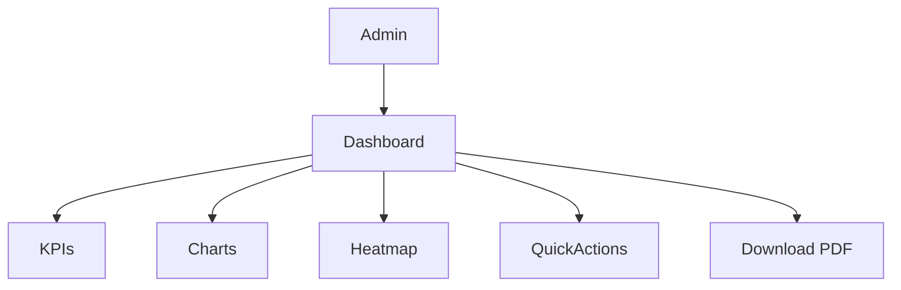

## Admin Directories & Search

- Admins can browse directories of Doctors, Hospitals, and Labs.
- Search and filters help quickly locate users and organizations.
- Clickable profiles open quick identity cards and details.

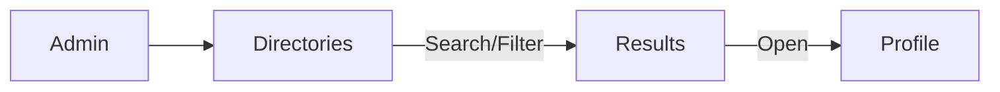

## Accessibility & Multilingual Support

- Accessibility widget: quick toggles for improved readability and comfort.
- Multilingual UI: interface strings and messages available in multiple languages (English and Indian languages), switchable from the top bar.

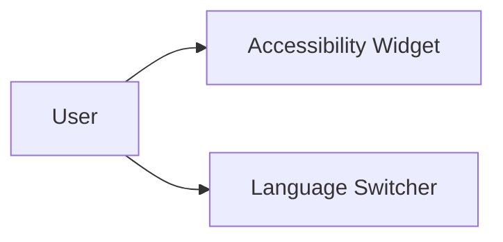

## Password Reset (Forgot Password)

- Reset using Health ID and OTP sent via email.
- Built‑in protections against excessive attempts.

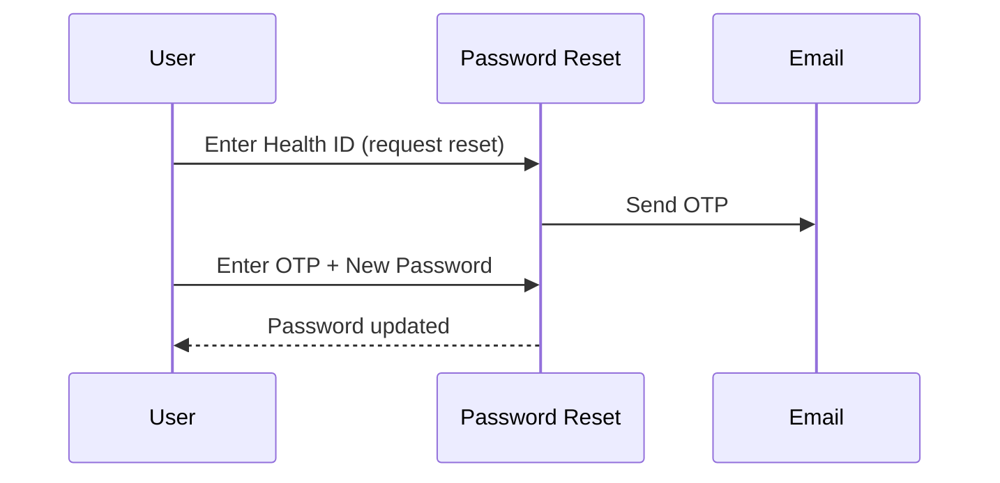

## Putting It All Together (End‑to‑End Example)

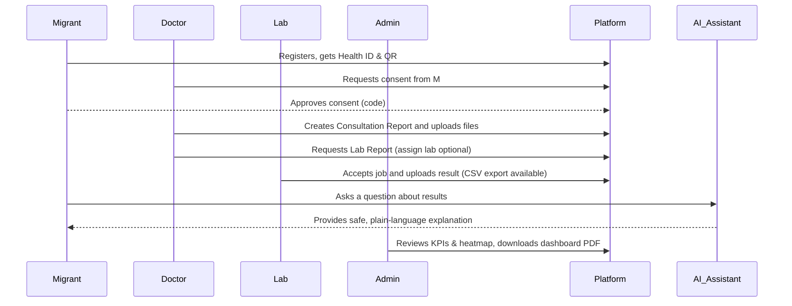

## Feature Checklist by Persona

- Migrant
  - Profile, ID card download, QR to public profile
  - Chatbot for personal guidance (disclaimer included)
  - Consent control (approve/revoke)
  - Multilingual UI and accessibility options

- Doctor / Hospital
  - Search/open patients; create Consultation Reports
  - Upload supporting files; manage allergies, medications, vaccinations
  - Request lab reports; assign labs when needed
  - View audit logs for accountability

- Lab
  - Jobs board: assigned/accepted/denied
  - Accept, deny with reason, upload final reports
  - CSV export of worklists

- Admins (Super/State/District/Subdivision/Block)
  - Hierarchical management by scope
  - Full Control enables inviting/manage next level
  - Directories, search, quick actions
  - Jurisdiction changes review
  - Dashboard with KPIs, charts, heatmap, and PDF download

## Glossary (User‑Facing Terms)

- Consultation Report: A doctor’s visit summary (date, type, notes)
- Attachment: A supporting document (e.g., scan or prescription)
- Consent: Patient’s permission allowing a provider to access records
- Emergency Access: Time‑limited read‑only access for urgent care
- Public Profile: A safe, limited profile reachable via QR
- ID Card: Printable ID with QR (CR80 size)

## Safety & Privacy Principles (Non‑Technical)

- Least privilege and consent‑first access
- Clear logs for every sensitive action
- Patient‑friendly wording and multi‑language guidance
- Explanations, not medical advice (explicit disclaimer)


# Project Guide: Migrant Health Records

This document orients a Developer to the project structure, key files, responsibilities, and conventions so it can navigate, answer questions, and make safe changes. Paths are relative to the repository root.

## High-level Overview

- Frontend: `frontend/` — React + Vite + TypeScript single-page app
- Backend: `backend/` — FastAPI + SQLAlchemy + PostgreSQL + Alembic
- Auth: JWT-based (access + refresh). Tokens are used via Authorization header and optionally cookies. OTP login supported.
- Storage: S3-compatible presigned URLs for file uploads/downloads
- Security: Rate limiting (Redis), HTTPS enforcement, security headers, password policy, OTP throttles
- RBAC: Delegated admin full_control can be granted down one level (superadmin -> state_admin; state_admin -> district_admin; district_admin -> subdivision_admin; subdivision_admin -> block_admin). Enforced in backend and reflected in frontend routing/nav gating.

## Troubleshooting

- **403 on POST /check**
  - Health check endpoint is GET-only to avoid CSRF. Use `GET /check` or `GET /healthz`.
- **401 on `/users/me` after reload**
  - Ensure access token is present/valid and `withCredentials` is configured if using cookies.
- **422 on `/auth/refresh`**
  - Verify a refresh token is provided (header or cookie as implemented). Re-login to obtain a new token pair.
- **CORS issues**
  - Set explicit `ALLOWED_ORIGINS` and `ALLOW_CREDENTIALS=true` when using cookies.
- **Stale GEO dropdowns**
  - Use the "Refresh Locations" button in Invitations. Ensure `geoCache` prefetch functions are called on relevant selection changes.
- **Migrations missing**
  - Run `alembic upgrade head` and confirm `DATABASE_URL` points to Postgres. Some features (e.g., invitations `full_control`) require latest migrations.

---

## Repository Layout

- `backend/`
  - `app/`
    - `main.py`: FastAPI app creation, CORS, middleware wiring, health endpoint; mounts routers
    - `auth.py`: Authentication and authorization utilities and endpoints
    - `db.py`: SQLAlchemy engine/session configuration (PostgreSQL only)
    - `schemas.py`: Pydantic models (request/response validation)
    - `middleware.py`: Redis-based rate limiting + logging, HTTPS/security headers middleware, decorators
    - `core/`
      - `config.py`: Centralized runtime config via environment variables (ENVIRONMENT, SECRET_KEY, DB, Redis, CORS, OTP, storage, etc.)
    - `routers/`
      - `attachments.py`: Presign upload/download and attachment listing with RBAC/consent checks
      - Other routers (mounted in `main.py`): patients, encounters, consents, consent-requests, invitations, geo, admin_geo, stats, notifications, admin_notes, jurisdiction_change_requests, emergency_access, vaccinations
      - `deps.py`: Common dependencies (role checks, consent access checks, audit logging). Frequently used symbols include `require_roles()`, `can_view_patient()`, `ensure_access_to_patient()`, `log_action()`
      - `models.py`: SQLAlchemy models (Users, Patients, Encounters, Attachments, Consents, RefreshToken, OtpCode, etc.)
  - `alembic/`: Database migrations; `env.py` configures Alembic; `versions/` has migration scripts
  - `requirements.txt`: Backend dependencies and versions
  - `scripts/`: Operational scripts (e.g., seeding superadmin)

- `frontend/`
  - `src/`
    - `api/client.ts`: Typed API client calling backend endpoints
    - `services/http.ts`: Axios instance; sets Authorization header from localStorage; `withCredentials: true` to support cookie-based auth too
    - `context/AuthContext.tsx`: App auth state: login, logout, OTP flows, user info, session versioning
    - `pages/`: UI pages (e.g., `Login.tsx`, `Register.tsx`, `Consents.tsx`, Patients list/details, admin pages, etc.)
    - `components/`: UI components (e.g., `PasswordField`)
    - `types`: Shared TS types (API models, routes, constants like `API_BASE`)
  - `.env`: Frontend environment (e.g., API base URL)

- Project docs: `SYSTEM_FLOWS.md`, `migrant_health_records_system_design_documentation.md`, `colour.md`

---

## Backend: Key Modules and Responsibilities

### `app/core/config.py`
Centralized environment-driven configuration. Important keys:
- Environment and secrets
  - `ENVIRONMENT` (development|staging|production)
  - `SECRET_KEY` (required in production)
  - `ALGORITHM` (JWT)
  - `ACCESS_TOKEN_EXPIRE_MINUTES` (15 in production by default)
- Database
  - `DATABASE_URL` (PostgreSQL only; `FORCE_POSTGRES=true` by default)
- CORS
  - `ALLOWED_ORIGINS`, `ALLOW_CREDENTIALS`
- Redis + Rate limiting
  - `REDIS_URL` and global rate limits: window, anon/auth limits, method-awareness, enable flag
  - `ENABLE_RATE_LIMIT_MIDDLEWARE` defaults to true in all environments (set to `false` to disable)
- Proxy and HTTPS
  - `TRUST_PROXY` — read `X-Forwarded-Proto` for HTTPS enforcement
- OTP settings
  - `OTP_EXPIRE_MINUTES`, `OTP_CODE_LENGTH`, `OTP_MAX_ATTEMPTS` (lower in prod)
- Storage/S3
  - `STORAGE_PROVIDER`, `S3_BUCKET`, AWS creds/region/endpoint
  - `S3_ADDRESSING_STYLE` (auto|path|virtual) — addressing style for AWS S3 vs MinIO
  - `PRESIGN_EXPIRE_SECONDS`, `MAX_UPLOAD_SIZE_BYTES`, `ALLOWED_UPLOAD_CONTENT_TYPES`
- Consent and session TTLs

### `app/db.py`
- SQLAlchemy engine creation (PostgreSQL enforced) and `SessionLocal`
- Connection pool settings to avoid stale connections

### `app/middleware.py`
- `RateLimitAndLogMiddleware`: Redis-based rate limiting with per-route overrides and request logging
- `rate_limit_policy(limit, window)`: decorator to set per-endpoint limits
- `SecurityHeadersAndHTTPSMiddleware`: In production, enforces HTTPS (redirect GET/HEAD; reject others) and adds headers: HSTS, X-Frame-Options, X-Content-Type-Options, Referrer-Policy

### `app/schemas.py`
- Pydantic v2 schemas for all API domains
- Strong password policy on `UserCreate.password` (min 12; must include upper/lower/digit/symbol)
- Models include: `UserCreate/Read`, `TokenPair`, OTP models, Patient/Encounter/Vitals, Attachments, Consents, Diseases, Invitations, JurisdictionChange, Emergency Access, Notifications, Admin Notes, Geo hierarchy

### `app/auth.py`
Primary auth flows:
- Password login: `POST /auth/token` — issues access + refresh
- OTP login: `POST /auth/otp/request`, `POST /auth/otp/verify`
- Refresh: `POST /auth/refresh` — rotates refresh tokens
- Logout: `POST /auth/logout` — revokes a refresh token
- Logout-all: `POST /auth/logout_all` — revokes all refresh tokens for user
- Guards: Blocks login/OTP verify if request already bears a valid JWT (via header or cookies)
- Rate limits: Per-endpoint limits via `rate_limit_policy`
- Password hashing: Passlib bcrypt
- Email: OTP email send (works when SMTP envs set)

Key helpers:
- `_extract_token_from_request()` — reads token from Authorization header or common cookie names
- `get_current_user_optional()` — resolves a user if token is valid; used to block re-login

### `app/routers/attachments.py`
- `POST /attachments/presign-upload`: Validates filename, content-type, and size; checks RBAC/consents; persists placeholder `Attachment`; returns S3 presign URL
- `GET /attachments/`: Lists attachments with RBAC scoping (migrant, provider with consent, scoped admins)
- `GET /attachments/{id}/presign-download`: Returns S3 presign URL for download
- `PATCH /attachments/{id}/status`: Update status
- `DELETE /attachments/{id}`: Best-effort deletion

Security controls for uploads:
- `MAX_UPLOAD_SIZE_BYTES` and `ALLOWED_UPLOAD_CONTENT_TYPES` enforced server-side
- Filename sanitization to prevent path traversal

### Other Routers (not exhaustive; mounted in `app/main.py`)
- `patients`, `encounters`, `consents`, `consent-requests`, `invitations`, `geo` (public and admin), `stats`, `notifications`, `admin_notes`, `jurisdiction_change_requests`, `emergency_access`
- Access control typically via `require_roles()` and `can_view_patient()` dependencies

### `app/main.py`
- Creates `FastAPI` app
- Adds CORS middleware with `ALLOW_CREDENTIALS` support when origins are explicit
- Adds `SecurityHeadersAndHTTPSMiddleware` in production
- Adds `RateLimitAndLogMiddleware` when enabled by config
- Mounts routers and exposes `/healthz`

---

## Frontend: Key Modules and Responsibilities

### `src/services/http.ts`
- Axios instance with `baseURL: API_BASE` and `withCredentials: true` (sends cookies)
- Adds Authorization header from `localStorage` when present
- Centralized response interceptor hooks (e.g., special handling on 422 during register)

### `src/api/client.ts`
- Typed wrapper functions for backend endpoints:
  - Auth: `/auth/token`, `/auth/register`, OTP flows, `/auth/logout`
  - Attachments: presign upload/download, list, update status
  - Patients/Encounters/Diseases/Stats
  - Consents, Consent Requests
  - Invitations, Notifications, Profiles, Geo queries, Jurisdiction changes, Emergency access

### `src/context/AuthContext.tsx`
- Exposes `user`, `login`, `logout`, `register`, `loginOtpStart`, `loginOtpVerify`, `sessionVersion`
- Loads `user` on boot if `access_token` in localStorage; compatible with cookie auth when backend sets cookies
- `logout()` revokes refresh token server-side (best-effort) and clears local tokens

### `src/pages/Login.tsx`
- Redirects authenticated users away from `/login` to `/patients`
- Supports both password and OTP login flows

### Other Pages and Components
- `src/pages/Register.tsx`, `src/pages/Consents.tsx`, patients pages, admin pages, etc.
- `src/components/` for shared UI pieces (e.g., `PasswordField`)

### App shell, routing, theming, i18n, notifications

- `src/App.tsx`
  - Central router. Uses `ProtectedRoute` for role-based access. Route gate for `/admin/invitations` allows only `superadmin` or admins with `full_control`; otherwise navigates to `/dashboard`.
- `src/components/layout/AppLayout.tsx`
  - Top navigation, language switcher via `react-i18next`, theme selector via `ThemeContext`, and session scoping (`sessionVersion`) to refresh views after auth events.
  - Hides the Invitations nav link unless user is `superadmin` or has `full_control`.
- `src/context/ThemeContext.tsx`
  - Manages light/dark/system modes; persists preference.
- `src/i18n.ts`
  - Loads translations from `public/locales/<lng>/translation.json`. Pages use `useTranslation()`.
- `src/components/ui/Toast.tsx`
  - Reusable toast/snackbar with variants (success/error/info). Used across admin flows, including Invitations.
- `src/services/geoCache.ts`
  - Geo caching utilities: `listStates`, `prefetchDistricts`, `prefetchSubdivisions`, `prefetchBlocks`, `clearAllGeoCache`. Used to keep dropdowns responsive and up-to-date.

### Frontend Route Map (from `src/App.tsx`)

- `/` — Redirects to `/dashboard` for admins or `/patients` for other authenticated roles; to `/login` when unauthenticated
- `/login` — Login page
- `/admin/login` — Admin login page
- `/admin/register-by-invite` — Complete admin registration via invitation code
- `/register` — User registration (migrant/provider/hospital)
- `/forgot-password` — Reset password via Health ID + OTP

- `/patients` — Protected; any authenticated user
- `/patients/:id` — Protected; any authenticated user with access
- `/consents` — Protected; roles: migrant, provider, hospital
- `/emergency-access` — Protected; roles: provider, hospital
- `/emergency-access/log` — Protected; role: migrant
- `/chat` — Protected; role: migrant (clinical RAG chatbot)
- `/profile` — Protected; role: migrant (private profile)
- `/practice` — Protected; roles: provider, hospital, lab
- `/lab/jobs` — Protected; role: lab (Lab jobs dashboard)
- `/profile/jurisdiction` — Protected; roles: provider, hospital (jurisdiction change request)

- `/dashboard` — Protected; role: admin (gated by role/subrole)
- `/admin/providers` — Protected; role: admin
- `/admin/hospitals` — Protected; role: admin
- `/admin/labs` — Protected; role: admin
- `/admin/diseases` — Protected; role: admin (superadmin or state_admin with `full_control`)
- `/admin/vaccines` — Protected; role: admin (superadmin or state_admin with `full_control`)
- `/admin/invitations` — Protected; role: admin (superadmin or any admin with `full_control`)
- `/admin/notifications` — Protected; role: admin
- `/admin/jurisdiction-requests` — Protected; role: admin
- `/admin/manage-admins` — Protected; role: admin (superadmin or any admin with `full_control`)

- `/profile/:healthId` — Public profile view (QR landing)
- `*` — Not Found fallback

---

## Auth Model

- Access Token: Short-lived JWT (15 minutes in production by default). Used for API calls.
- Refresh Token: Persistent token stored in DB; rotated on refresh; revocation supported via `/auth/logout` and `/auth/logout_all`.
- Token Carriage:
  - Authorization header: `Bearer <access_token>` from localStorage
  - Or cookies (if backend issues them). Frontend `http.ts` is configured to send cookies too.
- Re-login Guard: If a valid access token is present, `/auth/token` and `/auth/otp/verify` reject with `Already authenticated`.
- OTP: Request + Verify flow with throttles and attempt limits (stricter in production).

---

## Security Controls Summary

- **Password Policy**: Strong validation in `schemas.py` (`UserCreate.password`)
- **Rate Limiting**: Redis-based global middleware + per-endpoint decorators (`middleware.py`)
- **HTTPS Enforcement**: Production middleware redirects GET/HEAD to HTTPS and rejects non-idempotent HTTP; HSTS and security headers added
- **CORS**: Use explicit origins and `ALLOW_CREDENTIALS=true` when using cookies
- **Uploads**: Content-type allow-list and max size; filename sanitization; S3 presign
- **Access Control**: Role checks and consent gating via shared dependencies (`deps.py`)

---

## Running Locally

- Backend
  - Ensure PostgreSQL is available; set `DATABASE_URL`
  - Set `ENVIRONMENT=development`
  - Optional: configure `REDIS_URL` for rate limiting (middleware defaults ON in dev; disable via `ENABLE_RATE_LIMIT_MIDDLEWARE=false` if needed)
  - Run `uvicorn app.main:app --reload`
  - Chatbot prerequisites (OCR/NER):
    - Install Tesseract OCR (binary) and ensure it's on PATH (Windows installers available)
    - If PyMuPDF is unavailable, install Poppler and ensure it is on PATH (used by `pdf2image`)
    - First run will download MedCAT model from Hugging Face; ensure internet access and a writable HF cache directory

- Frontend
  - Set `.env` with `VITE_API_BASE` (consumed by `API_BASE` in `types`)
  - Run `npm install` and `npm run dev` in `frontend/`

- Production Configuration (important keys)
  - `ENVIRONMENT=production`
  - `SECRET_KEY` (required), `TRUST_PROXY=true` (behind reverse proxy)
  - `ENABLE_RATE_LIMIT_MIDDLEWARE=true`
  - `ACCESS_TOKEN_EXPIRE_MINUTES=15`
  - CORS with explicit `ALLOWED_ORIGINS` and `ALLOW_CREDENTIALS=true` if using cookies

---

## How to Add a New Feature (Developer Playbook)

1. Identify the domain area:
   - Backend: add schema(s) in `schemas.py`, model(s) in `models.py`, and an API router in `routers/<feature>.py`
   - Frontend: add client calls in `src/api/client.ts`, page(s) under `src/pages/`, and component(s) under `src/components/`
2. Wire backend router in `app/main.py` and ensure access control dependencies are applied (`require_roles`, `can_view_patient`)
3. Update `types` used by frontend where needed
4. Add rate limits for sensitive endpoints via `@rate_limit_policy`
5. If dealing with uploads, enforce `content_type`/`size` rules and sanitize filenames
6. Add tests (if test scaffold present) and update docs

---

## Conventions

- Paths: backend routers live under `app/routers/` with RESTful routes; use nouns and pluralization
- Security: default-deny posture; always add role/consent checks for data access
- Config: never hardcode secrets; read from `core/config.py`
- Responses: Pydantic models from `schemas.py`

---

## Quick Index of Important Files

- Backend
  - `backend/app/main.py`
  - `backend/app/auth.py`
  - `backend/app/core/config.py`
  - `backend/app/middleware.py`
  - `backend/app/schemas.py`
  - `backend/app/db.py`
  - `backend/app/routers/attachments.py`
  - `backend/app/models.py`
  - `backend/app/deps.py`

- Frontend
  - `frontend/src/services/http.ts`
  - `frontend/src/api/client.ts`
  - `frontend/src/context/AuthContext.tsx`
  - `frontend/src/pages/Login.tsx`, `frontend/src/pages/Register.tsx`, `frontend/src/pages/Consents.tsx`
  - `frontend/src/components/`
  - `frontend/src/types`

---

## Notes for Developers

- Always read and respect `app/core/config.py` when adding features; config toggles are commonly used and gate production-only behaviors.
- When modifying authentication flows, update both the backend endpoints (`auth.py`) and frontend integration (`AuthContext.tsx`, `services/http.ts`, and `api/client.ts`).
- For any new endpoints, consider adding `@rate_limit_policy` with appropriate limits.
- For data access to patient info or attachments, ensure consent checks via dependencies.
- When touching uploads, validate filename, content-type, and size server-side; never rely on client-side checks only.


---

## Recent Architectural Updates (Sept 2025)

Use this section to quickly orient to the latest patterns and where to apply them.

- __Declarative Authorization Dependencies__ (`backend/app/deps.py`)
  - New dependencies to keep routers clean and business-logic-only:
    - `require_superadmin()` — gate endpoints to superadmin only (used on `admin_geo` state CRUD).
    - `require_geo_scope_for_action(required_role, target_field)` — body-based scope check for create actions.
      - Examples:
        - District create: `required_role="state_admin"`, `target_field="state_id"`
        - Subdivision create: `required_role="district_admin"`, `target_field="district_id"`
        - Block create: `required_role="subdivision_admin"`, `target_field="subdivision_id"`
    - Path-aware update/delete dependencies:
      - `require_scope_for_district_update()/delete()` — compares admin’s `state_id` with target state (considering body change).
      - `require_scope_for_subdivision_update()/delete()` — compares `district_id`.
      - `require_scope_for_block_update()/delete()` — compares `subdivision_id`.
  - Keep `admin_in_scope_for_geo()` and `admin_in_scope_for_block()` for places that check entities loaded in code.

- __Routers Refactor__
  - `backend/app/routers/admin_geo.py`
    - States: create/update/delete require `require_superadmin`.
    - District/Subdivision/Block create: use `require_geo_scope_for_action`.
    - District/Subdivision/Block update/delete: use the new path-aware dependencies above.
    - Deletions guardrails: cannot delete a District with existing Subdivisions; cannot delete a Subdivision with existing Blocks; non-superadmin deletions allowed only within 6 hours of creation.
  - `backend/app/routers/jurisdiction_change_requests.py`
    - Approve now uses `admin_in_scope_for_block()` helper (single-line scope check).

- __Rate Limiting Default On (All Environments)__
  - `backend/app/core/config.py`: `ENABLE_RATE_LIMIT_MIDDLEWARE` now defaults to `true` across environments.
  - `backend/app/main.py`: Adds `RateLimitAndLogMiddleware` only when the flag is true. Disable by setting `ENABLE_RATE_LIMIT_MIDDLEWARE=false` for debugging.

- __Profiles Public Endpoint Performance Refactor__
  - `backend/app/routers/profiles.py`:
    - Uses `selectinload` to eager-load `Patient.vaccinations` and `PatientVaccination.vaccine` for efficient summaries.
    - Replaced broad `except Exception` with `except SQLAlchemyError` for DB operations (top diseases aggregation, health record fetch, vaccines summary).
    - Maintains aggregate queries for total/last encounters and top diseases.

- __Admin Invitations: Policy + UX__
  - Policy (backend `backend/app/routers/invitations.py`):
    - Superadmin can invite `state_admin` and may grant `full_control`.
    - Admins with `full_control` may invite exactly one level down and may grant `full_control` to that next-level:
      - `state_admin` -> `district_admin`
      - `district_admin` -> `subdivision_admin`
      - `subdivision_admin` -> `block_admin`
    - Jurisdiction validation ensures invited scope aligns with inviter’s jurisdiction. Pydantic `schemas.InvitationCreate.full_control` allows true; enforcement remains server-side.
  - Frontend (UX and gating):
    - `frontend/src/pages/AdminInvitations.tsx` now includes required "Name" input and "Expires in (hours)" input.
    - "Grant full control" checkbox is visible only to `superadmin` or admins with `full_control` and is sent in the payload accordingly.
    - Cascading selectors (State/District/Subdivision/Block) appear as required by target role and are refreshed using `onRefreshGeo()` to avoid stale options.
    - Route-level gating in `frontend/src/App.tsx` protects `/admin/invitations`; page-level safeguard also redirects non-eligible admins.
    - The "My Invitations" table uses typed `revoked` and `full_control`; revoke button condition is `!inv.used && !inv.revoked`.
  - `frontend/src/components/ui/Toast.tsx`:
    - Lightweight, reusable toast with auto-dismiss and variants: success/error/info.

- __Health Check Endpoint (CSRF-safe)__
  - `backend/app/main.py`: `/check` is now GET-only to avoid CSRF 403s on POST due to `CsrfMiddleware` (unsafe methods require a matching `X-CSRF-Token` header and `csrf_token` cookie unless exempted).
  - Probes should use `GET /check` or `GET /healthz`.

- __Registration Flow: Transaction + Logging__
  - `backend/app/auth.py` `register_user()`:
    - Removed nested `with db.begin():` (caused `InvalidRequestError: A transaction is already begun on this Session`).
    - Now performs a single `db.commit()` after creating `User` (and `Patient`/`MigrantProfile` for migrants).
    - Added structured logging with `logger.exception("register_user failed")` for diagnosis of unexpected errors (still returns HTTP 500 with a generic message).

- __Consent Requests: Auto-approval by Email (Migrant UI Simplified)__
  - `backend/app/routers/consent_requests.py`:
    - On provider/hospital create, system generates a unique consent code, sets status to `approved`, and emails the migrant immediately.
    - Audit events added: `requested`, `approved`, `code_generated`, `code_email_sent` (or `code_email_failed`).
  - `frontend/src/pages/Consents.tsx`:
    - Migrant “Approve” button removed; migrants can still Reject/Revoke.
    - Provider/Hospital flow remains unchanged: see status `approved` and enter code in “My Consent Requests” to get `granted`.

- __Email Templates__
  - Login OTP (backend `auth.py`): Subject "HealthLink Login OTP"; Body "Your HealthLink login otp is - <CODE>".
  - Consent Code (backend `consent_requests.py`):
    - Provider (doctor):
      - Body: "Dr. <PROVIDER_NAME> is requesting your Consent\nYour Unique code is <CODE>\nnote - IF you share this code Dr. <PROVIDER_NAME> can read and modify your health record"
    - Hospital:
      - Body: "<HOSPITAL_NAME> is requesting your Consent\nYour Unique code is <CODE>\nnote - IF you share this code <HOSPITAL_NAME> hospital can read and modify your health record"

- __Alembic Migration (idempotent)__
  - `backend/alembic/versions/c9d8e7f6_add_fk_constraints.py` adds missing FKs if absent (PostgreSQL-safe DO $$ blocks):
    - `admin_notes.author_id -> users.id (CASCADE)`
    - `admin_notes.patient_id -> patients.id (CASCADE)`
    - `attachments.encounter_id -> encounters.id (SET NULL)`
    - `jurisdiction_change_requests.user_id -> users.id (CASCADE)`
    - `jurisdiction_change_requests.requested_block_id -> blocks.id (RESTRICT)`
  - Downgrade drops the above constraints only.

- __i18n Conversions__
  - Pages now use `useTranslation()` and translation keys for banner messages:
    - `frontend/src/pages/AdminDiseases.tsx`
    - `frontend/src/pages/AdminJurisdictionRequests.tsx`
    - `frontend/src/pages/PatientDetail.tsx`
  - Locales updated with keys:
    - `frontend/public/locales/en/translation.json`
    - `frontend/public/locales/ne/translation.json`
    - `frontend/public/locales/bhb/translation.json`
  - i18n config: `frontend/src/i18n.ts` loads locales from `/public/locales/<lng>/translation.json`.

- __Catalogs Endpoint (Static Data moved server-side)__
  - `backend/app/routers/catalogs.py`: `GET /catalogs/medical-councils` serves medical councils.
  - Frontend client: `listMedicalCouncils()` in `frontend/src/api/client.ts`.
  - `frontend/src/pages/Register.tsx` consumes councils dynamically (no more hardcoded list).

- __Bulk Endpoints to avoid N+1__
  - Backend:
    - `POST /users/bulk` in `backend/app/routers/users.py` (return multiple users by IDs)
    - `POST /geo/bulk-names` in `backend/app/routers/geo_public.py` (resolve multiple geo names)
  - Frontend:
    - `bulkGetUsers`, `bulkGeoNames` in `frontend/src/api/client.ts`
    - `frontend/src/pages/AdminJurisdictionRequests.tsx` now batches user and geo lookups.

- __UI Terminology Update: Provider → Doctor__
  - All user-facing references to "Provider" are now displayed as "Doctor" across the UI.
  - Example updates:
    - `frontend/src/pages/Register.tsx`: role selector label shows "Doctor".
    - `frontend/src/pages/Consents.tsx`: table headers and section headings use "Doctor".
  - Note: Role keys remain `provider` in code and APIs for backward compatibility.

- __Forgot Password: 24-hour Lockout After 5 Failed Attempts__
  - Backend (`backend/app/auth.py`):
    - On invalid OTP attempts during `POST /auth/password/reset`, we increment `OtpCode.attempts`. After 5 failed attempts, we create a `password_reset_lock` record (in `otp_codes`) that blocks further sends and resets for 24 hours.
    - `POST /auth/password/forgot-send` checks for an active lock and returns 429 with a generic lockout message.
  - Frontend (`frontend/src/pages/ForgotPassword.tsx`):
    - Shows a clear message on 429: "You have made too many attempts. Please try again after 24 hours."

- __Admin Dashboard: Quick Actions and New KPIs__
  - Backend (`backend/app/routers/stats.py`):
    - Added `last_7d.new_migrants` and a scope-aware `active_doctors` count based on current admin's jurisdiction.
  - Frontend (`frontend/src/pages/AdminDashboard.tsx`, `frontend/src/types.ts`):
    - Displays new KPIs: "New Migrants (7d)" and "Active Doctors (Scope)".
    - Adds Quick Actions: "Invite New Admin", "Manage Admins", and "Manage Jurisdiction Requests" for a unified admin hub.

- __Frontend Choropleth Heatmap + Theming (Leaflet + React-Leaflet)__
  - Component: `frontend/src/components/HeatmapWidget.tsx`
    - Choropleth from GeoJSON (state/district/subdivision), matched by feature name (NAME_1/NAME_2/NAME_3).
    - Theme-aware (light/dark) map background, strokes, tooltips, and controls using CSS variables from `index.css`.
    - Color ramps:
      - Light: green → amber → red (static thresholds by default).
      - Dark: blue/cyan ramp for higher contrast.
    - Legend: Static or Quantile (20/40/60/80th percentiles computed from current data). Auto-falls back to Static if data sparse.
    - Interaction:
      - Hover: thicker outline in `--primary` color.
      - Click: For Patients metric, click navigates to filtered Patients; Shift-click selects (persistent highlight + info card). For other metrics, click selects.
      - Selection info panel includes Clear and (for Patients) Open patients.
    - Policy: Disease-based (chronic condition) heatmap disabled; only Patients/Encounters/Attachments supported.
  - Assets: place GeoJSON under `frontend/public/geo/` (served at `/geo/kerala_*.geojson`).
  - Types: install `@types/leaflet` and `@types/geojson` in `frontend`. Remove any temporary `src/types/leaflet.d.ts` stubs.
  - CSS: `frontend/src/index.css` includes semantic alert tokens and Leaflet control/tooltip theming.

- __Admin Dashboard Quick Actions Gating__
  - `frontend/src/pages/AdminDashboard.tsx` shows Quick Actions (Invite New Admin, Manage Admins, Manage Jurisdiction Requests) only for `superadmin` or admins with `full_control`. Directory links (Providers/Hospitals/Labs) remain visible to all admins.


## Endpoint Inventory (API surface)

All application routers are mounted under `/api/v1` in `backend/app/main.py`. Health checks exist at `/healthz` and `/check` (root-level).

- Auth (`backend/app/auth.py`)
  - POST `/api/v1/auth/token` — Password login; rate-limited; blocks if already authenticated
  - POST `/api/v1/auth/otp/request` — Request login OTP; rate-limited
  - POST `/api/v1/auth/otp/verify` — Verify OTP and issue tokens; rate-limited; blocks if already authenticated
  - POST `/api/v1/auth/refresh` — Rotate/refresh access token
  - POST `/api/v1/auth/logout` — Revoke presented refresh token
  - POST `/api/v1/auth/logout_all` — Revoke all refresh tokens for current user
  - (Also registration endpoints if present in auth router)

- Users (`backend/app/routers/users.py`)
  - GET `/api/v1/users/me` — Current user info
  - GET `/api/v1/users/{user_id}` — Read user by id

- Patients (`backend/app/routers/patients.py`)
  - GET `/api/v1/patients/` — List patients (scoped by role/consent/admin jurisdiction)
  - POST `/api/v1/patients/` — Create patient (providers/hospitals/admin)
  - GET `/api/v1/patients/{patient_id}` — Read patient (RBAC/consent check)
  - GET `/api/v1/patients/by-migrant/{migrant_id}` — Read patient for migrant user
  - PUT `/api/v1/patients/{patient_id}` — Update patient (ensure_access_to_patient)
  - DELETE `/api/v1/patients/{patient_id}` — Delete patient (ensure_access_to_patient)
  - GET `/api/v1/patients/{patient_id}/audit-logs` — Related audit logs

- Encounters (`backend/app/routers/encounters.py`)
  - GET `/api/v1/encounters/` — List encounters; optional `patient_id`
  - POST `/api/v1/encounters/` — Create encounter (writes require explicit consent)
  - GET `/api/v1/encounters/{encounter_id}` — Read encounter (RBAC/consent)
  - PUT `/api/v1/encounters/{encounter_id}` — Update encounter (writes require consent)
  - DELETE `/api/v1/encounters/{encounter_id}` — Delete encounter (writes require consent)

- Profiles (`backend/app/routers/profiles.py`)
  - GET `/api/v1/profiles/me` — Migrant's own profile (auto-backfills health_id/qr_token)
  - POST `/api/v1/profiles/` — Upsert migrant profile
  - GET `/api/v1/profiles/public/health-id/{health_id}` — Public profile by health id
  - GET `/api/v1/profiles/public/qr/{qr_token}` — Public profile by QR token

- Consents (`backend/app/routers/consents.py`)
  - POST `/api/v1/consents/grant`
  - POST `/api/v1/consents/grant-by-email`
  - GET `/api/v1/consents/mine`
  - GET `/api/v1/consents/granted-to-me`
  - POST `/api/v1/consents/{consent_id}/revoke`

- Consent Requests (`backend/app/routers/consent_requests.py`)
  - POST `/api/v1/consent-requests/` — Provider creates request
  - GET `/api/v1/consent-requests/mine` — Migrant's requests
  - GET `/api/v1/consent-requests/my-requests` — Provider's requests
  - PATCH `/api/v1/consent-requests/{id}/approve` — Migrant approves; returns code
  - PATCH `/api/v1/consent-requests/{id}/reject` — Migrant rejects
  - POST `/api/v1/consent-requests/{id}/enter-code` — Provider enters code to obtain session
  - PATCH `/api/v1/consent-requests/{id}/revoke` — Migrant revokes granted session

- Attachments (`backend/app/routers/attachments.py`)
  - POST `/api/v1/attachments/presign-upload` — Validates file and returns presign URL
  - GET `/api/v1/attachments/` — List attachments (scoped)
  - GET `/api/v1/attachments/{attachment_id}` — Get attachment metadata
  - GET `/api/v1/attachments/{attachment_id}/presign-download` — Presign download URL
  - PATCH `/api/v1/attachments/{attachment_id}/status` — Update status
  - DELETE `/api/v1/attachments/{attachment_id}` — Delete

- Health Records (`backend/app/routers/health_records.py`)
  - GET `/api/v1/migrants/{migrant_id}/records` — List health records (RBAC + consent or emergency)
  - POST `/api/v1/migrants/{migrant_id}/records` — Create health record (providers/hospitals with consent; admins bypass)

- Invitations (`backend/app/routers/invitations.py`)
  - POST `/api/v1/invitations/` — Create invitation (admin)
  - GET `/api/v1/invitations/by-code/{code}` — Get by code
  - GET `/api/v1/invitations/mine` — List created by current admin
  - PATCH `/api/v1/invitations/{invitation_id}/revoke` — Revoke

- Emergency Access (`backend/app/routers/emergency_access.py`)
  - POST `/api/v1/emergency-access/` — Create emergency grant
  - GET `/api/v1/emergency-access/migrant/{migrant_id}` — List grants
  - PATCH `/api/v1/emergency-access/{grant_id}/revoke` — Revoke grant

- Diseases (`backend/app/routers/diseases.py`)
  - GET `/api/v1/diseases/` — List
  - POST `/api/v1/diseases/` — Create (admin)
  - GET `/api/v1/diseases/stats` — Aggregated stats (admin)
  - POST `/api/v1/diseases/seed` — Seed defaults (admin)

- Vaccines (`backend/app/routers/vaccinations.py`)
  - GET `/api/v1/vaccines/` — List all configured vaccines (provider/hospital/admin/migrant)
  - POST `/api/v1/vaccines/` — Create vaccine (only `superadmin` or `state_admin`)
  - GET `/api/v1/patients/{patient_id}/vaccinations` — List vaccination statuses for a patient (done vs pending)
  - POST `/api/v1/patients/{patient_id}/vaccinations/mark-done` — Mark vaccine as done (provider/hospital; requires active consent)

- Notifications (`backend/app/routers/notifications.py`)
  - GET `/api/v1/notifications/mine` — List current user's notifications
  - PATCH `/api/v1/notifications/{notification_id}/read` — Mark read
  - PATCH `/api/v1/notifications/read-all` — Mark all read
  - GET `/api/v1/notifications/stream` — SSE stream (token via header or query)

- Admin GEO (`backend/app/routers/admin_geo.py`)
  - CRUD for States, Districts, Subdivisions, Blocks under `/api/v1/admin/geo/*` (admin)
  - PATCH `/api/v1/admin/geo/users/{user_id}/assign-jurisdiction` — Assign admin/provider jurisdiction

- GEO Public (`backend/app/routers/geo_public.py`)
  - GET lists for states/districts/subdivisions/blocks under `/api/v1/geo/*`
  - GET single resource by id: `/api/v1/geo/states/{id}`, etc.

- Jurisdiction Change Requests (`backend/app/routers/jurisdiction_change_requests.py`)
  - POST `/api/v1/jurisdiction-change-requests/` — Provider/hospital submit
  - GET `/api/v1/jurisdiction-change-requests/mine` — List mine (provider/hospital)
  - GET `/api/v1/jurisdiction-change-requests/` — Admin list (scoped)
  - PATCH `/api/v1/jurisdiction-change-requests/{id}/approve|reject` — Admin actions

- Stats (`backend/app/routers/stats.py`) [admin]

- Chat (`backend/app/routers/chat.py`)
  - POST `/api/v1/chat/ask` — Clinical RAG over recent attachments + Gemini answer
  - GET `/api/v1/chat/health` — Preloads MedCAT/SBERT and reports status (ops)
  - GET `/api/v1/stats/kpis`
  - GET `/api/v1/stats/encounters_timeseries`
  - GET `/api/v1/stats/patients_timeseries`
  - GET `/api/v1/stats/attachments_timeseries`


---

## Data Model Overview (key entities and relationships)

- `User`
  - Fields: id, email, hashed_password, role (`migrant|provider|hospital|admin...`), phone, registration numbers, jurisdiction (state/district/subdivision/block)
  - Rels: has many `Patient` (created_by), has one `MigrantProfile`, has many `RefreshToken`, has many `Consent` (granted/received)

- `Patient`
  - Links to `migrant_user_id` (optional) and `created_by` (provider/hospital/admin)
  - Has many `Encounter`, `Attachment`, `Medication`, `LabResult`, `PatientVaccination`

- `Encounter`
  - Belongs to `Patient`, created by `User`
  - Has one `Vitals`
  - Many-to-many with `Disease` via `encounter_diseases`

- `Attachment`
  - Belongs to `Patient` and optional `Encounter`
  - Tracks storage info: bucket, storage_key, content_type, size, status

- `Consent`
  - Migrant grants consent to provider/admin (`migrant_id` -> `granted_to`), with `scope_json`, `expires_at`, `revoked`

- `ConsentRequest`
  - OTP-based session grant: `provider_id`, `migrant_id`, `status`, `code`, `code_valid_until`, `session_expires_at`
  - `ConsentAudit` events track lifecycle actions

- `RefreshToken`
  - Persistent refresh token per user with `revoked` flag and expiry

- `OtpCode`
  - Stores per-user OTPs, attempts, expiry

- `HealthRecord`
  - Append-only records of changes (JSONB) authored by providers/admins for a migrant

- `EmergencyAccessGrant`
  - Time-limited read-only access for emergencies with audit and notifications

- `AdminNote`, `Notification`
  - Admin-only patient notes; user-targeted notifications (+ SSE stream)

- `Vaccine`
  - Fields: id, name (unique), created_at, created_by
  - Rels: has many `PatientVaccination`

- `PatientVaccination`
  - Fields: id, patient_id, vaccine_id, status (`pending|done`), done_at, marked_by, created_at
  - Unique: (`patient_id`, `vaccine_id`)
  - Rels: belongs to `Patient` and `Vaccine`

- GEO: `State`, `District`, `Subdivision`, `Block`
  - Hierarchical administrative geography for scoping admins and providers

- `MigrantProfile`
  - One-to-one with migrant `User`; includes `health_id`, `qr_token`, photo, address


---

## Testing Guide (pytest + Testcontainers)

- Recommended dev dependencies:
  - `pytest`, `pytest-asyncio`, `httpx`, `testcontainers[postgres]`, `pip-audit`, `bandit`

- Example approach:
  1. Create `backend/tests/conftest.py` to spin up a Postgres container and set `DATABASE_URL` for the app
  2. Initialize the schema via Alembic migrations (or `Base.metadata.create_all` for smoke tests)
  3. Use FastAPI `TestClient` or `httpx.AsyncClient` to hit `/api/v1/*`

- Critical tests:
  - Auth: weak password rejected; login/refresh/logout revocation; “Already authenticated” guard works
  - RBAC & Consents: providers need active consent; migrants only access self; admins scoped by jurisdiction
  - Attachments presign: rejects invalid filename/content-type/oversize
  - Rate limits: 429 after threshold on `/auth/*`


---

## Ops Runbook (env, migrations, deployment)

- Environment variables (see `backend/app/core/config.py`):
  - `ENVIRONMENT` (production enables HTTPS/HSTS middleware and R/L default)
  - `SECRET_KEY` (required in production)
  - `DATABASE_URL` (PostgreSQL; enforced)
  - CORS: `ALLOWED_ORIGINS`, `ALLOW_CREDENTIALS`
  - Rate Limiting: `REDIS_URL`, `ENABLE_RATE_LIMIT_MIDDLEWARE`, `RATE_LIMIT_*`
  - HTTPS behind proxy: `TRUST_PROXY=true`
  - Auth: `ACCESS_TOKEN_EXPIRE_MINUTES` (15 in prod default)
  - OTP: `OTP_EXPIRE_MINUTES`, `OTP_CODE_LENGTH`, `OTP_MAX_ATTEMPTS`
  - Storage: `S3_BUCKET`, `AWS_*`, `S3_ENDPOINT_URL`, `S3_ADDRESSING_STYLE` (auto|path|virtual), `MAX_UPLOAD_SIZE_BYTES`, `ALLOWED_UPLOAD_CONTENT_TYPES`

  Tip:
  - AWS S3 default works with `S3_ADDRESSING_STYLE=virtual` (or omit to auto-detect virtual when no custom endpoint is set).
  - MinIO typically uses `S3_ENDPOINT_URL=http://localhost:9000` and `S3_ADDRESSING_STYLE=path` (auto mode will choose path when a custom endpoint is present).

- Migrations:
  - Use Alembic under `backend/alembic/`. Typical commands:
    - `alembic revision --autogenerate -m "message"`
    - `alembic upgrade head`

- Deployment checklist (backend):
  - Set env vars above, particularly `SECRET_KEY`, DB URL, CORS, Redis, HTTPS/proxy flags
  - `ENVIRONMENT=production`, `ENABLE_RATE_LIMIT_MIDDLEWARE=true`, `TRUST_PROXY=true`
  - Ensure reverse proxy sets `X-Forwarded-Proto=https` and terminates TLS
  - Monitor health: `/healthz` and `/check`

- Frontend:
  - `VITE_API_BASE` points to backend `/api/v1` origin
  - If using cookie auth, ensure backend CORS allows credentials and specific origins


# Migrant Health Records - Frontend

A React + Vite + TypeScript SPA integrated with the FastAPI backend.

## Prerequisites

- Node.js 18+
- Backend running at `http://127.0.0.1:8000` (default), with CORS allowing the frontend origin

## Configure

Create a `.env` file in this folder to override defaults if needed:

```
VITE_API_BASE=http://127.0.0.1:8000/api/v1
```

The backend already defaults `ALLOWED_ORIGINS` to `*`. If you have locked it down, set:

Windows PowerShell (in the backend shell):
```
$env:ALLOWED_ORIGINS = "http://127.0.0.1:5173"
```
Then restart the backend server.

## Install & Run (dev)

In a terminal:
```
npm install
npm run dev
```
Open http://127.0.0.1:5173

## Features

- Auth: register (migrant/provider/admin), login, logout
- Patients: list (consent-scoped), detail
- Encounters: list, create (consent enforced server-side)
- Attachments (S3): presign upload, upload via signed URL, mark available, download via presigned URL
- Consents: grant by provider email, list mine, list granted-to-me, revoke
- Audit logs: per-patient view of actions

## Notes

- For S3 uploads, configure backend env: `STORAGE_PROVIDER=s3`, `S3_BUCKET`, and AWS creds/region or `S3_ENDPOINT_URL` (MinIO). If not configured, upload endpoints return 501/500.
- Rate limiting is enabled on the backend. Hammering endpoints may return 429 depending on your settings.

## Routes and Roles

The app uses route-level guards via `ProtectedRoute` in `src/App.tsx`.

- `/` — Redirects to `/dashboard` (admins) or `/patients` (others) when authenticated; `/login` otherwise
- `/login` — Login
- `/admin/login` — Admin login
- `/admin/register-by-invite` — Admin registration via invite code
- `/register` — Register (migrant/provider/hospital)
- `/forgot-password` — Forgot/Reset password via Health ID + OTP

- `/patients` — Protected (any authenticated role)
- `/patients/:id` — Protected (access-scoped by backend)
- `/consents` — Protected (migrant, provider, hospital)
- `/emergency-access` — Protected (provider, hospital)
- `/emergency-access/log` — Protected (migrant)
- `/chat` — Protected (migrant) — Clinical RAG chatbot
- `/profile` — Protected (migrant)
- `/practice` — Protected (provider, hospital, lab)
- `/lab/jobs` — Protected (lab)
- `/profile/jurisdiction` — Protected (provider, hospital)

- `/dashboard` — Protected (admin)
- `/admin/providers` — Protected (admin)
- `/admin/hospitals` — Protected (admin)
- `/admin/labs` — Protected (admin)
- `/admin/diseases` — Protected (admin; superadmin or state_admin with full_control)
- `/admin/vaccines` — Protected (admin; superadmin or state_admin with full_control)
- `/admin/invitations` — Protected (admin; superadmin or any admin with full_control)
- `/admin/notifications` — Protected (admin)
- `/admin/jurisdiction-requests` — Protected (admin)
- `/admin/manage-admins` — Protected (admin; superadmin or any admin with full_control)

- `/profile/:healthId` — Public profile view (QR landing)

## Chatbot (Clinical RAG)

- Page: `src/pages/Chat.tsx`
- Backend endpoint: `POST /api/v1/chat/ask`
- Health: `GET /api/v1/chat/health` (reports MedCAT/SBERT/ocr status)
- Behavior:
  - Retrieves a personalized patient summary and scans recent attachments
  - Uses SBERT embeddings for similarity; MedCAT 2.1.0 for clinical NER (spaCy fallback)
  - Extracts text via PyMuPDF; falls back to Tesseract OCR (and `pdf2image` if PyMuPDF is not available)
  - Generates answers with Gemini 2.5 Flash (Google Search tools enabled; falls back to 1.5 Flash)

## i18n

- Config: `src/i18n.ts` loads translations from `public/locales/<lng>/translation.json`
- Many pages use `useTranslation()` and keys like `t('login.title')`
