# Migrant Health Records System — Functional Flows and Diagrams

This document references key files and endpoints. It contains diagrams (flowcharts and sequence diagrams) and explanations only; no source code is included.

Sections:

- Platform overview and roles
- Geo hierarchy and jurisdiction model
- Authentication and OTP
- Admin invitation and registration by invite
- Admin geo management
- Jurisdiction change request (submit and admin review)
- Patients and profiles
- Encounters and attachments
- Consents and emergency access
- Notifications
- Stats and dashboard
- Admin notes

---

## Platform overview and roles

- The system is a full-stack FastAPI + React application.
- Key backend components live in `backend/app/`.
- Key frontend components/pages live in `frontend/src/`.

Roles:

- `superadmin`
- `state_admin`
- `district_admin`
- `subdivision_admin`
- `block_admin`
- `provider`
- `hospital`
- `migrant`

High-level flow (system context):

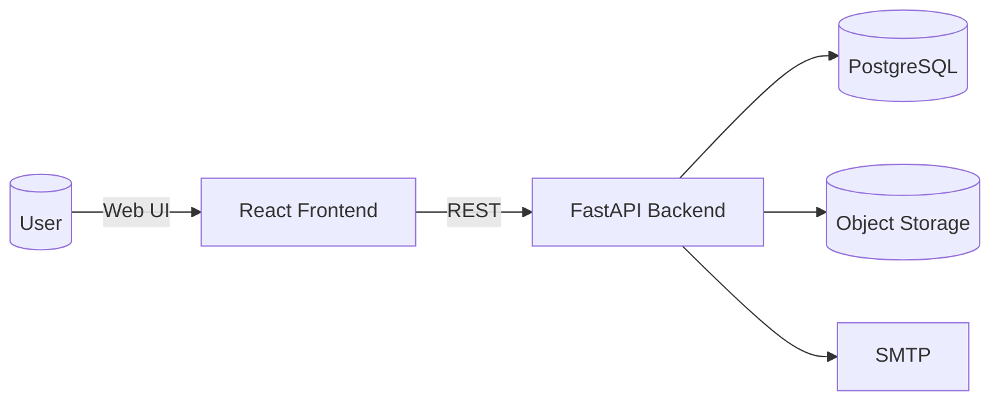

---

## Geo hierarchy and jurisdiction model

Geo entities (ordered from broadest to most specific):

- State → District → Subdivision → Block/Municipality

Admins are scoped by jurisdiction:

- A `state_admin` is scoped to a State
- A `district_admin` is scoped to a District (and implicitly its State)
- A `subdivision_admin` is scoped to a Subdivision (and implicitly its District and State)
- A `block_admin` is scoped to a Block (and implicitly its parents)

Public/Helper endpoints:

- `backend/app/routers/geo_public.py` provides GET by ID for State, District, Subdivision, Block (used to show human-readable names in UI).
- `backend/app/routers/admin_geo.py` provides admin-only CRUD for States, Districts, Subdivisions, Blocks and `assign-jurisdiction` for users.

Geo reference diagram:

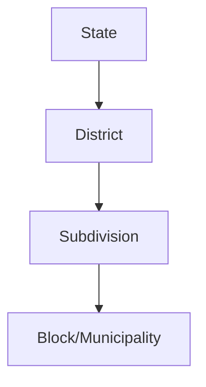

---

## Authentication and OTP

Files:

- `backend/app/auth.py` — auth router, OTP endpoints, admin register-by-invite
- `backend/app/deps.py` — role checks and helpers

Flows:

- Password login for all roles
- OTP (email) based login for users (optional) with rate limiting and dev echo config

Password login flow:

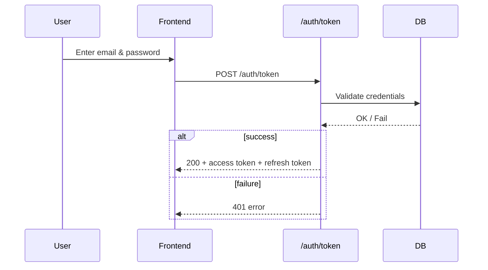

OTP flow (simplified):

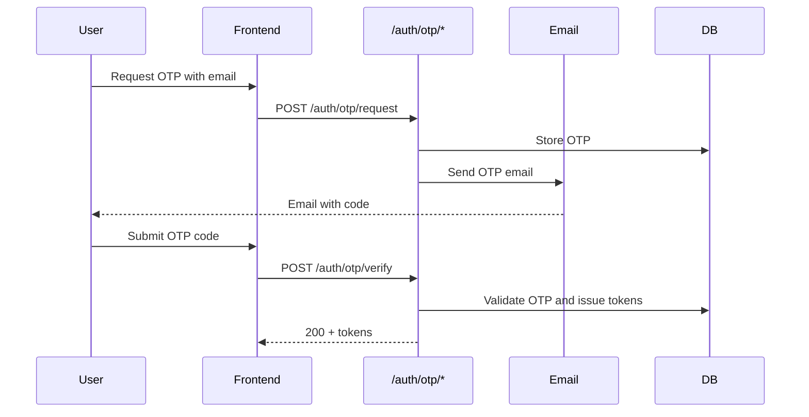

---

## Admin invitation and registration by invite

Files:

- `backend/app/routers/invitations.py`
- `backend/app/auth.py` (register by invite)
- `frontend/src/pages/AdminInvitations.tsx` (create invites)
- `frontend/src/pages/AdminRegisterByInvite.tsx` (complete registration)

Key design:

- Invites are one-level down only (`superadmin`→`state_admin`, `state_admin`→`district_admin`, `district_admin`→`subdivision_admin`, `subdivision_admin`→`block_admin`).
- The `invited_name` is the geo unit name (not a personal name). It is locked on the registration page and enforced server-side.
- If the invite contains no scope IDs, the server creates/reuses the appropriate geo unit under the inviter’s jurisdiction at registration time, assigns the new admin’s jurisdiction, and marks the invite used.

Invitation creation flow (admin):

```mermaid
flowchart TD
  A[Admin (inviter)] -->|Create| B[Invitation]
  B -->|Code shared| C[Invitee]
```

Registration by invite flow:

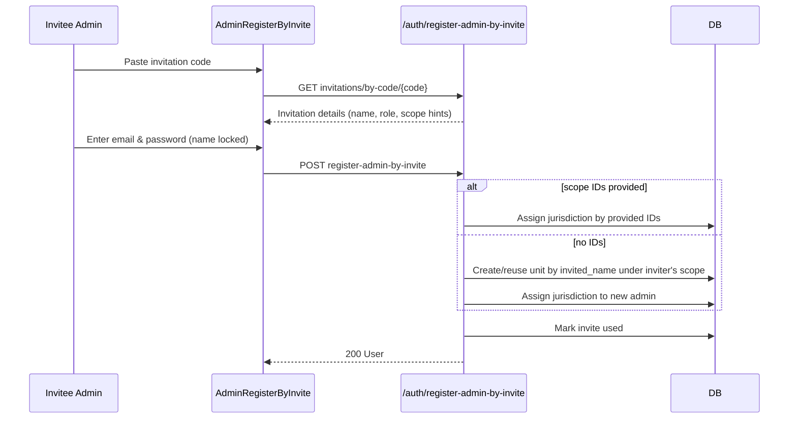

---

## Admin geo management

File: `backend/app/routers/admin_geo.py`

- List/Create/Update/Delete: States, Districts, Subdivisions, Blocks
- Assign a user’s jurisdiction via `PATCH /admin/geo/users/{user_id}/assign-jurisdiction`

Flow (create entities):

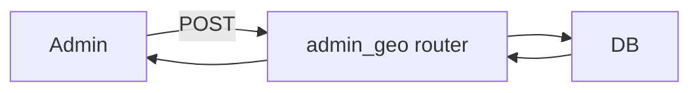

---

## Jurisdiction change request (submit and admin review)

Files:

- Submit and view own: `frontend/src/pages/EditJurisdiction.tsx`
- Admin review: `frontend/src/pages/AdminJurisdictionRequests.tsx`
- Backend: `backend/app/routers/jurisdiction_change_requests.py`

User submit flow:

```mermaid
flowchart TD
  U[Provider/Hospital] -->|Select new Block & optional reason| FE[EditJurisdiction]
  FE -->|POST /jurisdiction-change-requests| BE
  BE --> DB
  BE -->|Respond| FE
  FE -->|Show Created (pending)| U
```

Admin review flow:

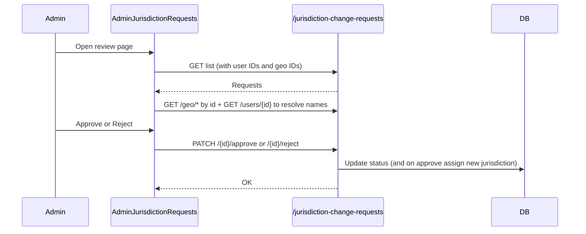

---

## Patients and profiles

Files:

- `backend/app/routers/patients.py`, `backend/app/routers/profiles.py`
- `frontend/src/pages/Patients.tsx`, `frontend/src/pages/PatientDetail.tsx`, `frontend/src/pages/MyProfile.tsx`, `frontend/src/pages/PublicProfile.tsx`

Overview:

- Patients represent medical records linked to migrant users or created by providers/hospitals.
- Profiles include identifiers like `health_id`, `qr_token`, and demographic information.

Access control (simplified):

- Admins: broad access, possibly scoped by jurisdiction (see `deps.py` helpers)
- Providers/Hospitals: need active consent or emergency access to view patient details
- Migrants: can view their own profile and linked patient record

---

## Encounters and attachments

Files:

- `backend/app/routers/encounters.py`
- `backend/app/routers/attachments.py`

Flow (attachments presign + upload):

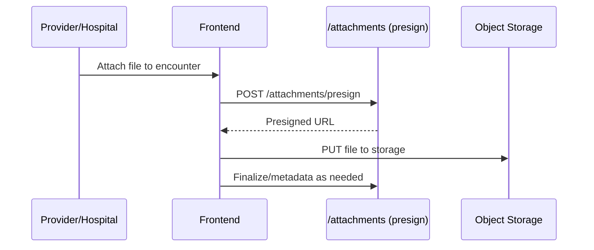

---

## Consents and emergency access

Files:

- `backend/app/routers/consents.py`
- `backend/app/routers/consent_requests.py`
- `backend/app/routers/emergency_access.py`
- Helpers in `backend/app/deps.py` (`has_active_consent`, `has_emergency_access`, `ensure_access_to_patient`)

Consent request flow (OTP-based):

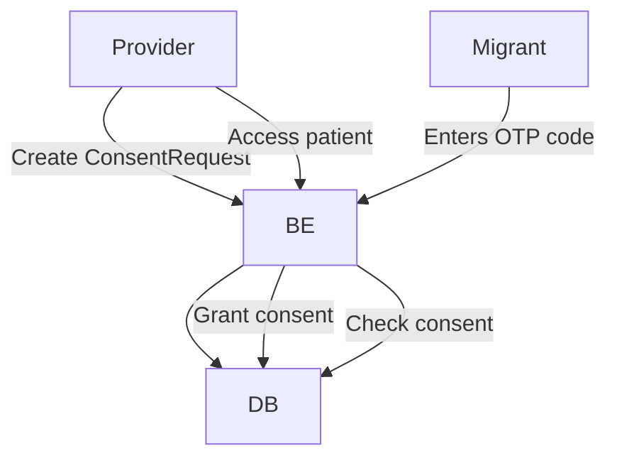

Emergency access flow:

- Providers can request emergency access; if granted and not expired, access is allowed even without consent.

---

## Notifications

Files:

- `backend/app/routers/notifications.py`
- `frontend/src/pages/AdminNotifications.tsx`

Flow:

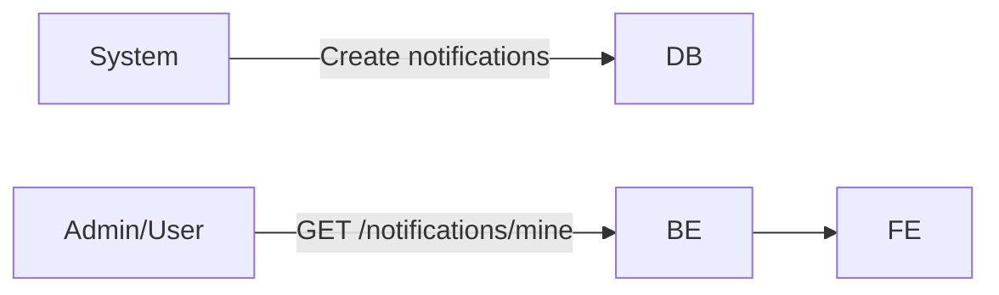

---

## Stats and dashboard

Files:

- `backend/app/routers/stats.py`
- `frontend/src/pages/AdminDashboard.tsx`

Data sources:

- KPIs, disease stats, and time series for encounters, patients, and attachments.

Dashboard flow:

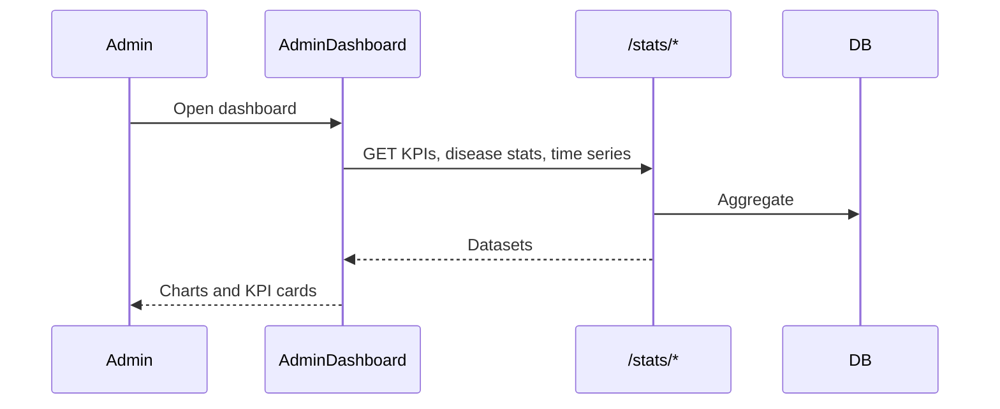

---

## Admin notes

Files:

- `backend/app/routers/admin_notes.py`
- `frontend/src/pages/PatientDetail.tsx` (usage, if applicable)

Flow:

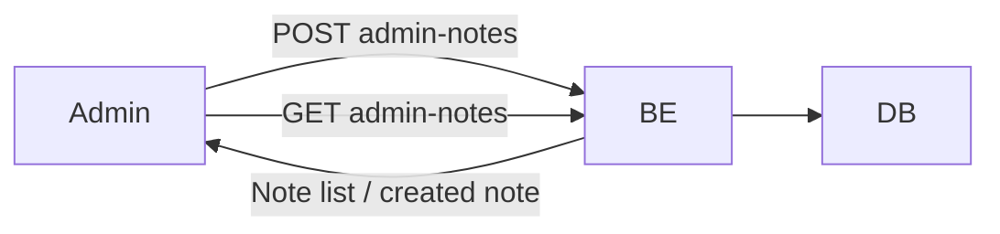

---

## Cross-cutting concerns

- Roles and permissions are enforced in routes via `require_roles` (`backend/app/deps.py`).
- Jurisdiction-aware access helpers exist (e.g., for viewing patients or migrant profiles).
- Alembic migrations under `backend/alembic/versions/` manage schema changes.
- Frontend universal UI patterns: container, card, table, button styles, responsive layout, accessibility via aria-live regions.

Legend for diagrams:

- Sequence diagrams illustrate request/response sequences.
- Flowcharts show overall process steps and decisions.

If a new feature is added, extend this document with:

- A short purpose statement
- Referenced backend router(s) and frontend page/component(s)
- A flowchart or sequence diagram of the key interactions
- Notes on permissions and data dependencies