# System Overview (Non‑Technical)

This document explains how real users interact with the Migrant Health Records platform. It focuses on roles, journeys, and outcomes — not implementation details. Diagrams are provided to visualize flows.

- Audience: Judges, program managers, health officials
- Scope: Frontend UX, user flows, admin oversight, safety controls, and interoperability

## Personas and Roles

- Migrant (patient)
- Doctor (provider)
- Hospital
- Lab
- Admins (Super Admin, State Admin, District Admin, Subdivision Admin, Block Admin)

## High‑Level System Context

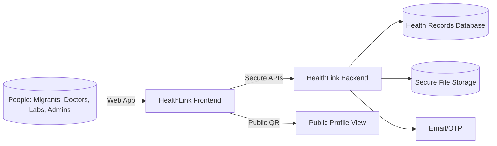

## Registration & Login (OTP supported)

- Email/password sign-up for all roles (migrant, doctor, hospital, lab)
- OTP support (email) for login and password reset

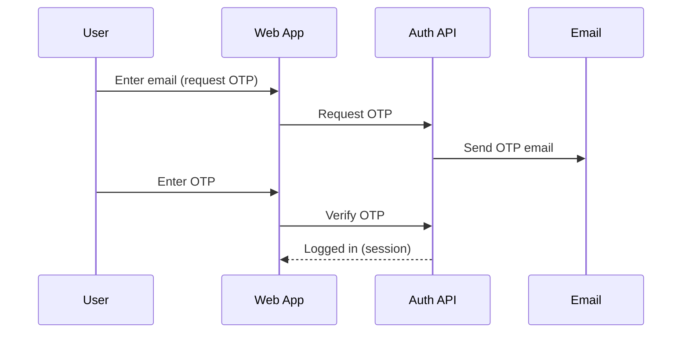

## Super Admin & Admin Hierarchy (Full Control vs Limited)

- Super Admin creates and manages the entire geo hierarchy.
- Admins are scoped to a geographic unit: State → District → Subdivision → Block/Municipality.
- Full Control delegates power to invite and manage the next level down; limited access allows viewing and basic operations within assigned scope.

```mermaid
flowchart TD
  SA[Super Admin] -->|Invite/Assign| STA[State Admin]
  STA -->|Invite/Assign (with Full Control)| DA[District Admin]
  DA -->|Invite/Assign (with Full Control)| SDA[Subdivision Admin]
  SDA -->|Invite/Assign (with Full Control)| BA[Block Admin]

  classDef fullC fill:#d1fae5,stroke:#10b981,color:#065f46
  STA:::fullC
  DA:::fullC
  SDA:::fullC
  BA:::fullC
```

- Full Control enabled: admin can create invites and manage sub-units under their scope.
- Full Control disabled: admin can operate within their own scope (view data, manage within unit) but cannot delegate or create sub-admins.

## Creating New Jurisdiction Units

- Super Admin can create States; State Admins can create Districts; District Admins can create Subdivisions; Subdivision Admins can create Blocks.

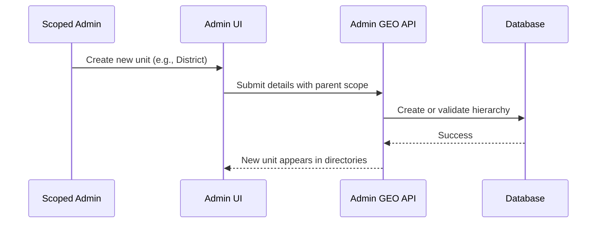

## Invitations and Admin Sign‑Up

- Super Admin or Full‑Control Admins can invite the next level admin.
- Invitee completes registration using a code; scope and permissions are enforced automatically.

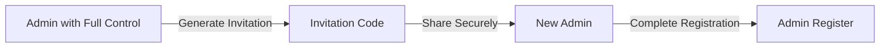

## Migrant Registration & QR/ID Card

- Migrants register, update profile, and can download a printable ID card (CR80)
- Each migrant has a Health ID and QR code linking to a public profile (limited, safe data)

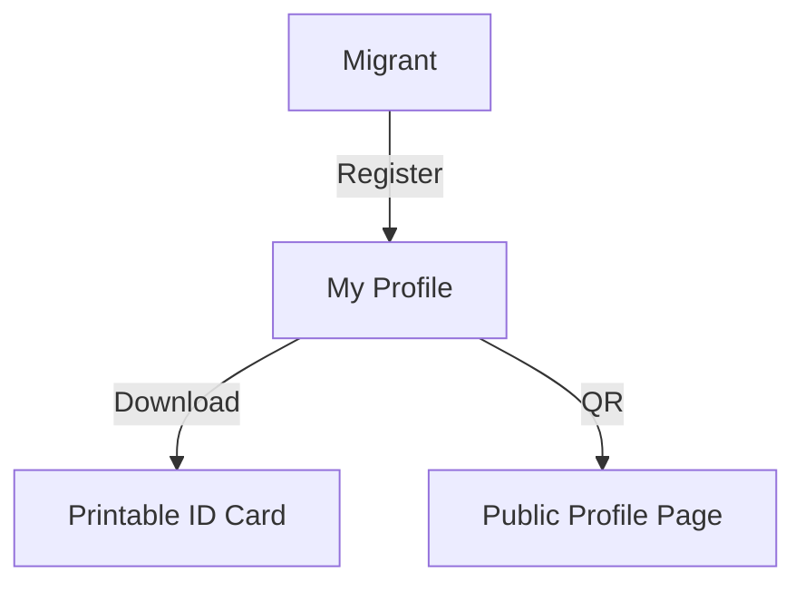

## Doctor–Patient Collaboration

- Doctors search/view patients (as permitted), create a Consultation Report (instead of technical term “encounter”), upload files, request lab reports, and manage vaccinations/allergies/medications.

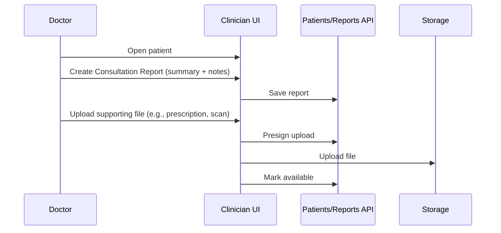

- Consultation Report = clinical visit summary (date, type, notes, optional diseases).
- Attachments = any supporting documents, safely stored and downloadable with permission.

## Consent (Patient‑Centric Access)

- Providers and hospitals need the migrant’s consent to view or update detailed records.
- Consent requests generate a one‑time code for the patient.
- Patient can revoke consent at any time.

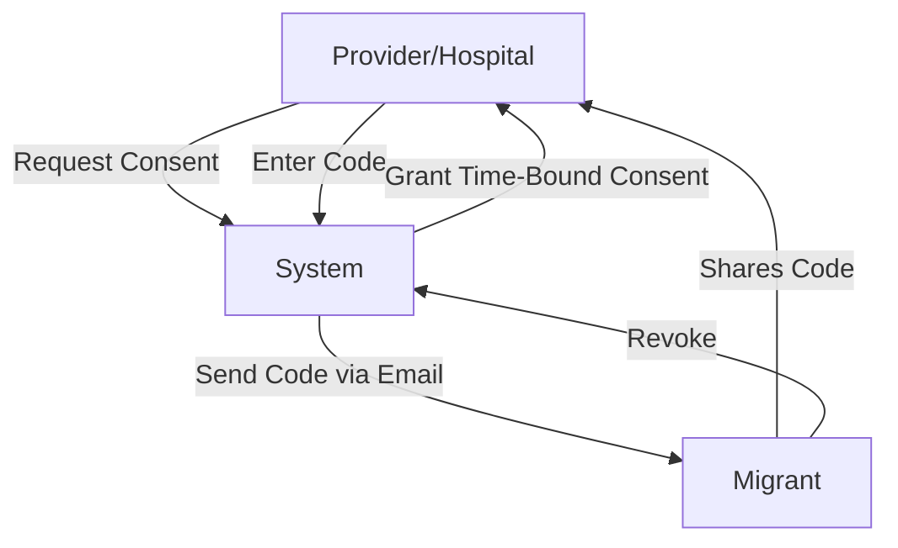

## Emergency Protocol

- In emergencies, a time‑limited read‑only access can be granted with audit logging.
- This enables safe access without a prior consent flow.

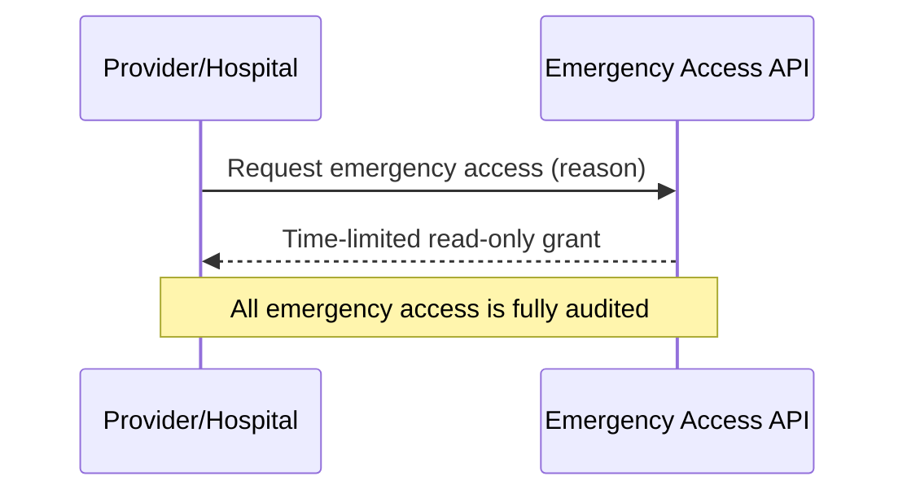

## Lab Workflow (Assigned Jobs, Uploads, CSV)

- Doctors can request lab reports; optionally assign a specific lab.
- Labs work from a dedicated Jobs panel: Assigned, Accepted, Denied.
- Labs can claim/accept jobs, deny with reason, upload finalized reports, and export tables to CSV.

```mermaid
flowchart LR
  Doctor -->|Request Report| System
  System -->|Assign (optional)| Lab
  Lab -->|Accept/Claim| Worklist
  Lab -->|Upload Report| Storage
  System -->|Mark Completed| Doctor
  System -->|Notify| Migrant
  Lab -->|CSV Export| Local
```

## Migrant Chatbot (Personal Health Assistant)

- Migrants can ask plain‑language questions.
- The assistant summarizes personal records and recent reports to give helpful, safe explanations.
- Multi‑language responses for Indian languages and English.
- Clear disclaimer: information only, not medical advice.

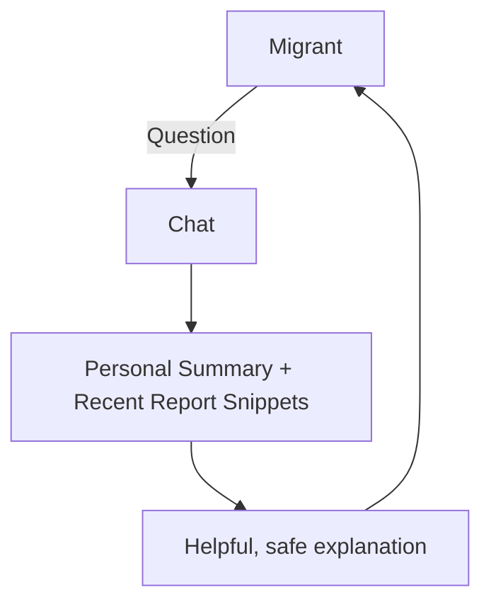

Key features:

- Answers in the user’s language when possible
- Can include insights from recent uploaded reports
- Designed to educate, not diagnose; always closes with a clear disclaimer

## FHIR‑Compatible (Read‑Only Interoperability)

- The system exposes read‑only FHIR endpoints (e.g., Patient, Encounter, Observation, DocumentReference, Condition, Immunization, and $everything) to enable interoperability.
- This supports aggregation and safe external consumption by standards‑based client apps.

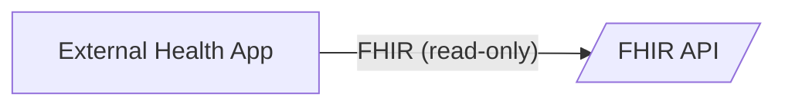

## Audit Logs (Transparency)

- Every important action (creating reports, uploading files, changing consent, emergency grants) is logged.
- Patient detail view shows who did what and when.
- Export/Record‑keeping: On‑page logs can be printed/downloaded for audits.

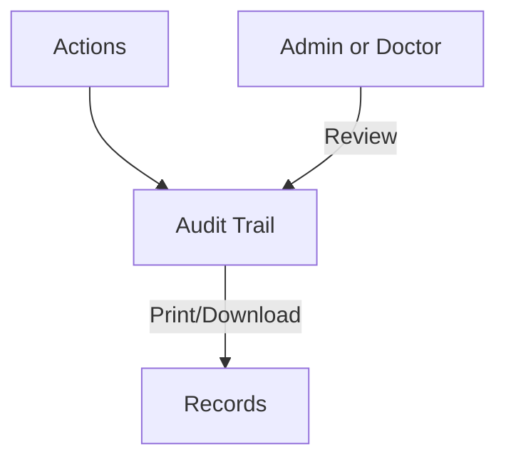

## Admin Dashboard & Heatmap

- KPIs: users, patients, consultation reports, attachments, active consents
- Time‑series charts: growth and trends
- Choropleth heatmap for geography‑aware insights
- Quick actions: invite admins, manage admins, jurisdiction requests
- Download option: One‑click PDF of the dashboard view

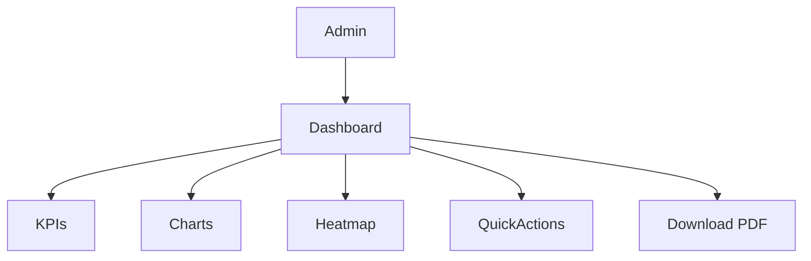

## Admin Directories & Search

- Admins can browse directories of Doctors, Hospitals, and Labs.
- Search and filters help quickly locate users and organizations.
- Clickable profiles open quick identity cards and details.

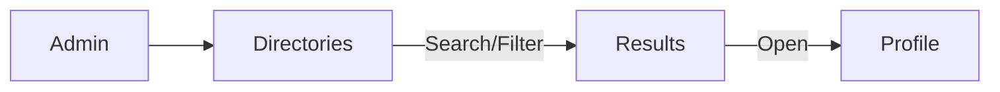

## Accessibility & Multilingual Support

- Accessibility widget: quick toggles for improved readability and comfort.
- Multilingual UI: interface strings and messages available in multiple languages (English and Indian languages), switchable from the top bar.

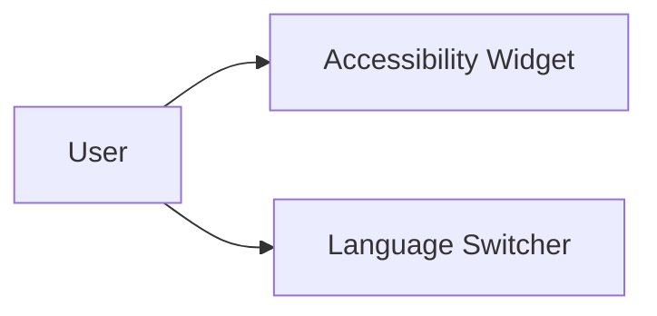

## Password Reset (Forgot Password)

- Reset using Health ID and OTP sent via email.
- Built‑in protections against excessive attempts.

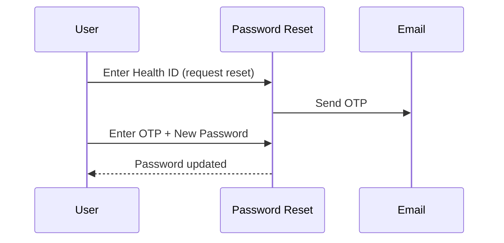

## Putting It All Together (End‑to‑End Example)

```mermaid
sequenceDiagram
  participant M as Migrant
  participant D as Doctor
  participant L as Lab
  participant A as Admin
  participant System as Platform
  participant Chatbot as AI Assistant

  M->>System: Registers, gets Health ID & QR
  D->>System: Requests consent from M
  M-->>System: Approves consent (code)
  D->>System: Creates Consultation Report, uploads files
  D->>System: Requests Lab Report (assign lab optional)
  L->>System: Accepts job, uploads result (CSV export available)
  M->>Chatbot: Asks a question about results
  Chatbot-->>M: Safe, plain‑language explanation
  A->>System: Reviews KPIs & heatmap; downloads dashboard PDF
```

## Feature Checklist by Persona

- Migrant
  - Profile, ID card download, QR to public profile
  - Chatbot for personal guidance (disclaimer included)
  - Consent control (approve/revoke)
  - Multilingual UI and accessibility options

- Doctor / Hospital
  - Search/open patients; create Consultation Reports
  - Upload supporting files; manage allergies, medications, vaccinations
  - Request lab reports; assign labs when needed
  - View audit logs for accountability

- Lab
  - Jobs board: assigned/accepted/denied
  - Accept, deny with reason, upload final reports
  - CSV export of worklists

- Admins (Super/State/District/Subdivision/Block)
  - Hierarchical management by scope
  - Full Control enables inviting/manage next level
  - Directories, search, quick actions
  - Jurisdiction changes review
  - Dashboard with KPIs, charts, heatmap, and PDF download

## Glossary (User‑Facing Terms)

- Consultation Report: A doctor’s visit summary (date, type, notes)
- Attachment: A supporting document (e.g., scan or prescription)
- Consent: Patient’s permission allowing a provider to access records
- Emergency Access: Time‑limited read‑only access for urgent care
- Public Profile: A safe, limited profile reachable via QR
- ID Card: Printable ID with QR (CR80 size)

## Safety & Privacy Principles (Non‑Technical)

- Least privilege and consent‑first access
- Clear logs for every sensitive action
- Patient‑friendly wording and multi‑language guidance
- Explanations, not medical advice (explicit disclaimer)
